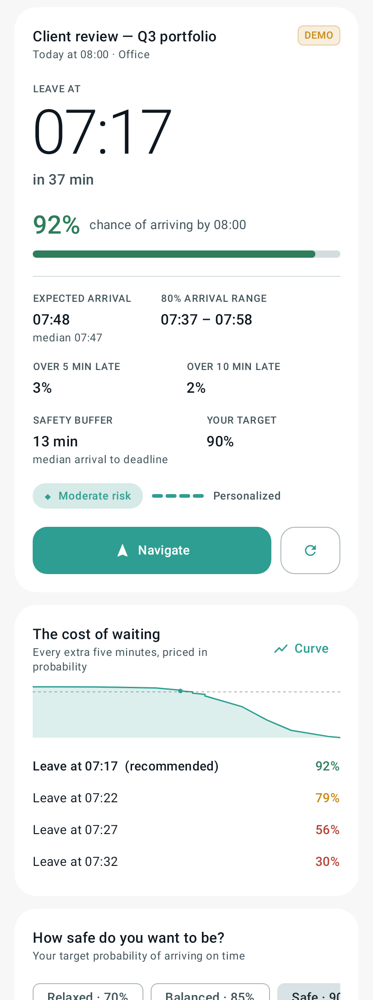
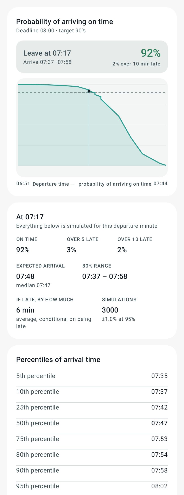
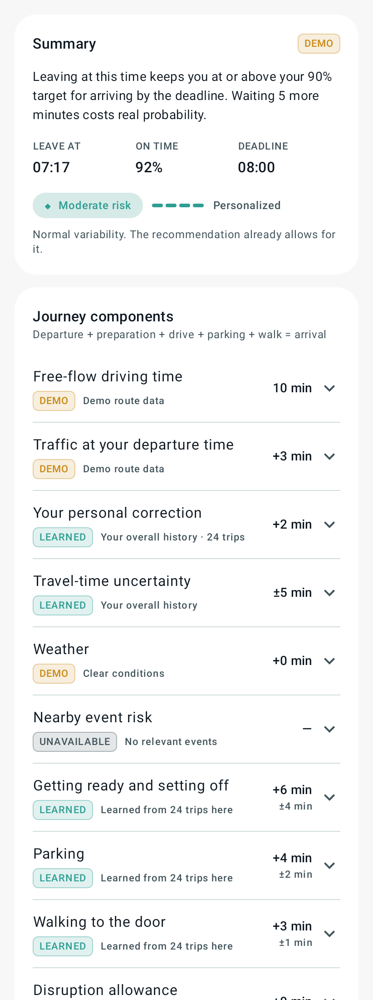
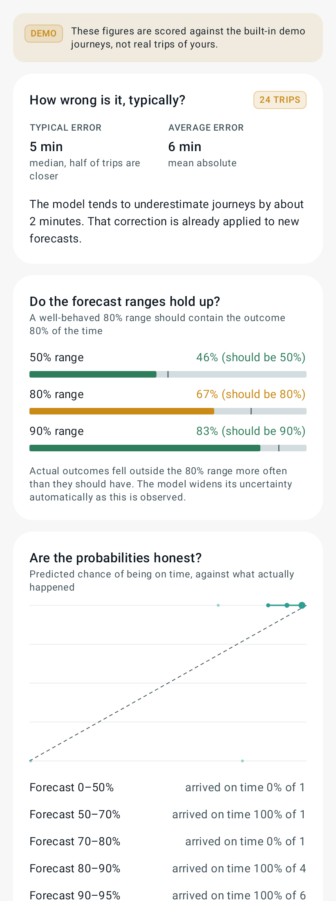
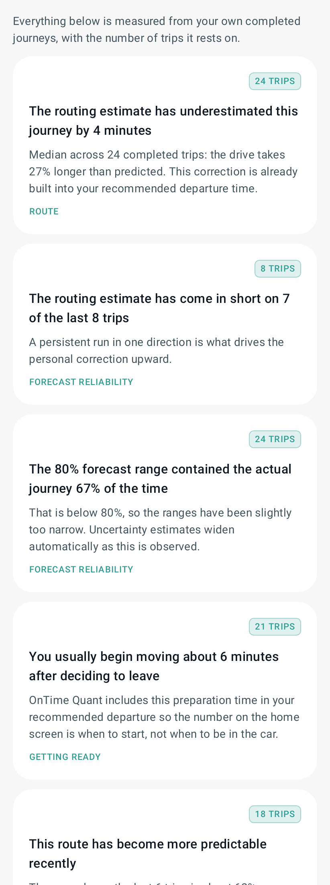
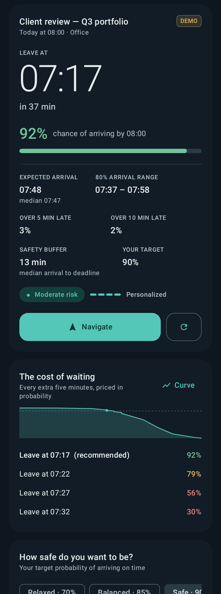

# OnTime Quant

A predictive punctuality assistant for Android.

Navigation apps answer *"how long will the trip take?"* and give you a single number with
no stated confidence. OnTime Quant answers a different and more useful question:

> **What is the latest time I can leave and still have a 90% chance of arriving on time?**

It simulates thousands of versions of your journey — traffic at the minute you actually
reach the road, how long you take to get out of the door, parking, the walk in, weather,
nearby events — and solves for the latest departure that clears the confidence target you
chose.



---

## Contents

- [What it does](#what-it-does)
- [Screenshots](#screenshots)
- [Architecture](#architecture)
- [Module structure](#module-structure)
- [Setup](#setup)
- [API keys](#api-keys)
- [Google Cloud configuration](#google-cloud-configuration)
- [Permissions](#permissions)
- [Demo mode](#demo-mode)
- [Build and test commands](#build-and-test-commands)
- [Quantitative methodology](#quantitative-methodology)
- [Data model](#data-model)
- [Privacy](#privacy)
- [Known limitations](#known-limitations)
- [Production-readiness checklist](#production-readiness-checklist)

---

## What it does

For a chosen appointment, OnTime Quant produces:

| Output | Example |
| --- | --- |
| Latest safe departure | `07:17` |
| Probability of arriving by the deadline | `92%` |
| Expected and median arrival | `07:48` / `07:47` |
| 80% arrival range | `07:37 – 07:58` |
| Probability of being > 5 / > 10 minutes late | `3%` / `2%` |
| Traffic risk classification | `Moderate` |
| Recommended safety buffer | `13 min` |
| Cost of waiting | `07:22 → 79%`, `07:27 → 56%`, `07:32 → 30%` |
| Personalisation level | `Personalized`, based on 24 trips on this route |

Every one of those numbers is produced by the forecasting engine from a routing estimate, a
stored observation, a user setting or a documented prior. None of them is a stored UI
value. The screenshots in this repository are rendered by running the real engine.

Beyond the forecast, the app provides:

- an **interactive departure curve** you can drag across, reporting the model's own answer
  for every candidate minute;
- a **component breakdown** stating where each contribution came from and what it means;
- **walk-forward backtesting** and **calibration** — the model is scored only against
  forecasts it could actually have made before each trip;
- **model insights** generated from your own journeys, each with its sample size, and
  nothing at all when the evidence is too thin;
- **restrained notifications** that fire on material change, not on a timer.

---

## Screenshots

All images below are rendered from the real engine over the built-in demo scenario
(`./gradlew :app:recordRoborazziDebug`).

| Departure decision | Departure curve |
| --- | --- |
|  |  |

| Forecast details | Model accuracy |
| --- | --- |
|  |  |

| Model insights | Dark theme |
| --- | --- |
|  |  |

---

## Architecture

Clean architecture, MVVM, unidirectional data flow.

```
┌──────────────────────────── :app ────────────────────────────┐
│  UI (Compose)          ViewModels          Workers           │
│  screens, components   immutable UiState   WorkManager       │
│         │                     │                  │           │
│         └─────────────────────┴──────────────────┘           │
│                               │                              │
│  Repositories: JourneyRepository · ForecastRepository ·      │
│                TripRepository · ProviderRegistry             │
│                               │                              │
│  Provider adapters      Room DAOs        DataStore           │
│  Google Routes/Places   19 entities      UserSettings        │
│  Open-Meteo, TM         + migrations                         │
│  Calendar, Fused Loc.                                        │
└──────────────────────────────┬───────────────────────────────┘
                               │  (pure Kotlin, no Android)
┌──────────────────────── :forecasting ────────────────────────┐
│  ForecastEngine  ·  MonteCarlo  ·  DepartureSolver           │
│  TravelModel (bias + residuals)  ·  DurationModel            │
│  Shrinkage  ·  EventPressureModel  ·  Backtester             │
│  CalibrationAnalyser  ·  InsightEngine  ·  DemoScenario      │
└──────────────────────────────┬───────────────────────────────┘
┌───────────────────────── :core-model ────────────────────────┐
│  Domain types  ·  Provider interfaces  ·  ProviderResult     │
└──────────────────────────────────────────────────────────────┘
```

Rules the codebase actually enforces:

- **The forecasting engine is pure Kotlin.** `:forecasting` is a JVM library with no
  Android dependency, so it cannot accidentally reach for a `Context`, and it runs at full
  speed in unit tests. Its 121 tests execute in a few seconds.
- **Every external service is behind an interface** (`RoutesProvider`, `PlacesProvider`,
  `WeatherProvider`, `EventsProvider`, `CalendarRepository`, `LocationTracker`,
  `NavigationLauncher`). Swapping Google Routes for another provider touches one file.
- **Providers never throw across the boundary.** They return `ProviderResult.Success` or
  `ProviderResult.Failure` carrying a plain-language notice, so a dead network degrades the
  forecast instead of crashing it.
- **No business logic in composables.** Screens render an immutable `UiState`.
- **Provenance travels with every value.** `DataProvenance` is attached to each component
  of the forecast and rendered as a chip, so demo and cached data can never be mistaken for
  live data.

---

## Module structure

Three modules, all of them substantive. The brief allows more; a larger number of thin
modules would have added build surface without adding boundaries that the code actually
respects.

| Module | Type | Contents |
| --- | --- | --- |
| `:core-model` | Kotlin JVM | Domain models, provider interfaces, `ProviderResult`, geo maths |
| `:forecasting` | Kotlin JVM | The entire quantitative engine, the demo scenario, 121 unit tests |
| `:app` | Android | UI, DI, Room, DataStore, provider adapters, workers, notifications |

Package boundaries inside `:app` mirror what would otherwise be separate modules:
`data/db`, `data/prefs`, `data/remote/{routes,places,weather,events}`, `data/calendar`,
`data/location`, `data/nav`, `data/repository`, `di`, `notifications`, `work`, and
`ui/{theme,format,components,navigation,onboarding,home,curve,details,appointment,calendar,journeys,history,insights,accuracy,settings}`.

---

## Setup

### Requirements

| Tool | Version |
| --- | --- |
| Android Studio | Ladybug (2024.2.1) or newer |
| JDK | 17 or newer (built and tested on JDK 21) |
| Gradle | 8.11.1 (via the wrapper — do not install separately) |
| Android Gradle Plugin | 8.7.3 |
| Kotlin | 2.0.21 |
| compileSdk / targetSdk | 35 |
| minSdk | 26 (Android 8.0) |

### First run

```bash
git clone <this repository>
cd OnTimeQuant
./gradlew :app:assembleDebug
```

That is all. **No API key is required.** With no keys configured the app starts in demo
mode with a complete Abu Dhabi journey and 24 trips of history already loaded.

---

## API keys

Keys are read from `local.properties` (git-ignored) or from environment variables, and are
injected as `BuildConfig` fields. They are never committed.

Copy the example file and fill in what you have:

```bash
cp local.properties.example local.properties
```

```properties
# local.properties  (git-ignored)
sdk.dir=/path/to/Android/sdk

MAPS_API_KEY=your_routes_api_key
PLACES_API_KEY=your_places_api_key
TICKETMASTER_API_KEY=your_discovery_api_key
```

| Key | Used for | Required? |
| --- | --- | --- |
| `MAPS_API_KEY` | Google **Routes API v2** — traffic-aware durations | No. Absent → demo routing, and demo mode cannot be switched off. |
| `PLACES_API_KEY` | Google **Places API (New)** — destination search | No. Absent → offline gazetteer of Abu Dhabi landmarks. |
| `TICKETMASTER_API_KEY` | **Discovery API** — nearby-event risk | No. Absent → event risk excluded, and the UI says so. |

Open-Meteo needs no key and is used whenever demo mode is off.

Environment variables of the same names also work, which is what CI should use:

```bash
MAPS_API_KEY=... ./gradlew :app:assembleRelease
```

---

## Google Cloud configuration

1. Create a project at <https://console.cloud.google.com/>.
2. Enable **Routes API** and **Places API (New)**.
3. Create an API key under *APIs & Services → Credentials*.
4. Restrict it — this matters, an unrestricted key on a shipped APK is a billing incident
   waiting to happen:
   - *Application restrictions* → **Android apps**, then add your package name
     (`com.ontimequant`, or `com.ontimequant.debug` for debug builds) with the SHA-1 of the
     signing certificate:
     ```bash
     keytool -list -v -keystore ~/.android/debug.keystore -alias androiddebugkey \
       -storepass android -keypass android | grep SHA1
     ```
   - *API restrictions* → restrict to Routes API and Places API only.
5. Set a **budget alert** and a **quota cap**. A forecast issues one routing request per
   five-minute departure slot (about 20–25 per forecast over a two-hour window); the
   in-app cache suppresses repeats within four minutes, and the background worker only
   refreshes appointments inside a four-hour horizon.

Ticketmaster Discovery keys come from <https://developer.ticketmaster.com/>.

---

## Permissions

Only `INTERNET` is non-optional, and even that is unused in demo mode.

| Permission | Why | If declined |
| --- | --- | --- |
| `ACCESS_FINE_LOCATION` / `ACCESS_COARSE_LOCATION` | "Use my current location" as a journey origin; detecting when you set off | Pick an origin from your saved places. Everything else works. |
| `ACCESS_BACKGROUND_LOCATION` | Arrival detection by geofence without the app open | Confirm arrival with one tap on the home screen. |
| `READ_CALENDAR` | Finding appointments that have a location, read-only, only for calendars you tick | Enter appointments by hand. |
| `POST_NOTIFICATIONS` | Departure reminder and material-change alerts | No notifications; the app still forecasts. |

No permission is requested on first launch without an explanation of what it buys, and
every one of them can be skipped in onboarding.

---

## Demo mode

Demo mode is a **complete, functioning app**, not a mock-up.

- Origin: Sun Tower, Shams Abu Dhabi, **Al Reem Island**
- Destination: an office in **Al Danah, central Abu Dhabi**
- Appointment: **08:00**, arriving exactly at the start time
- 24 completed weekday commutes of history, generated by a seeded simulator
- A built-in traffic profile with a genuine morning-peak build
- Weather (hot, hazy), two nearby events, parking and walking history

The demo appointment goes through the **same repository, the same engine and the same
screens** as a live one. The only difference is which provider implementations are wired
in, and everything is labelled `DEMO`.

The resulting departure curve, generated by the engine:

| Leave at | On-time probability |
| --- | --- |
| 07:15 | 94% |
| 07:20 | 88% |
| 07:25 | 71% |
| 07:30 | 45% |

Those values are asserted for *shape* — strictly declining, accelerating cost of waiting —
by `DemoCalibrationTest`, not asserted as literals, because they are outputs.

To reset the demo: **Settings → Data source → Reset demo data**.

---

## Build and test commands

Exact commands, all run from the repository root.

```bash
# Build the debug APK
./gradlew :app:assembleDebug
# → app/build/outputs/apk/debug/app-debug.apk

# Forecasting engine tests (pure JVM, fast)
./gradlew :forecasting:test

# App unit tests (Robolectric + MockWebServer + Room in-memory)
./gradlew :app:testDebugUnitTest

# Everything
./gradlew test

# Android Lint
./gradlew :app:lintDebug
# → app/build/reports/lint-results-debug.html

# Re-render the screenshots in app/screenshots/
./gradlew :app:recordRoborazziDebug

# Build the instrumentation test APK
./gradlew :app:assembleDebugAndroidTest

# Run the Compose UI test (requires a connected device or emulator)
./gradlew :app:connectedDebugAndroidTest
```

### APK location

```
app/build/outputs/apk/debug/app-debug.apk
```

---

## Quantitative methodology

The full treatment, with formulas and file references, is in
**[`docs/METHODOLOGY.md`](docs/METHODOLOGY.md)**. In outline:

```
Arrival   = Departure + Preparation + Travel(Departure + Preparation)
                      + Parking + Walking
Deadline  = EventStart − EntryBuffer
Solve     t* = max { t : P(Arrival(t) ≤ Deadline) ≥ c }
```

- The routing baseline is evaluated at `Departure + Preparation`, not at `Departure`. You
  are not on the road while you are still finding your keys, and during a building peak
  that distinction is worth minutes.
- Prediction error is modelled **multiplicatively**, as `log(actual / predicted)`, because
  travel-time errors scale with trip length.
- Bias is estimated hierarchically — system prior → your overall history → this
  origin/destination → this route → this route at this time of day — with conjugate
  normal-normal shrinkage. Nested levels are credited only with the evidence they add
  beyond their parent, so one trip is never counted four times.
- Uncertainty uses robust statistics (median, MAD × 1.4826, winsorised moments) and, once
  there is enough personal history, a **smoothed empirical bootstrap** over your own
  residuals rather than a fitted Gaussian.
- A compound-Poisson right tail models genuine disruption, which is what makes the arrival
  distribution skewed: you can be very late, but not symmetrically very early.
- Every candidate departure is simulated with **common random numbers**, which is why the
  departure curve is smooth without post-hoc manipulation.
- Backtesting is strictly walk-forward and structurally leak-free.

---

## Data model

19 Room entities. The ones that matter:

| Entity | Purpose |
| --- | --- |
| `SavedLocationEntity` | Places you saved. The only coordinates ever stored. |
| `SavedJourneyEntity` | An origin/destination pair; the key for route-level learning. |
| `AppointmentEntity` | Deadline as an absolute instant **plus its own zone id**. |
| `RouteForecastEntity` | Headline forecast, so the home screen has something instantly. |
| `CandidateDepartureForecastEntity` | One row per curve point. |
| `PredictionSnapshotEntity` | The component breakdown, for audit and for the details screen. |
| `CompletedTripEntity` | Four instants and the durations. **No path, no trace.** |
| `TripObservationEntity` | The single in-flight journey. |
| `ModelResidualEntity` | Raw `log(actual/predicted)`, so MAD and the bootstrap can be recomputed. |
| `RouteBiasStateEntity` | EWMA cache — always rebuildable from residuals. |
| `Preparation/Parking/WalkingObservationEntity` | The three non-driving components. |
| `CalibrationResultEntity`, `CalibrationBucketEntity` | Latest walk-forward score. |
| `NotificationStateEntity` | Cool-down and deduplication, surviving process death. |
| `RouteCacheEntity` | Short-lived routing cache with its true fetch time. |

**Migration strategy.** Version 1 is the first schema; `MIGRATIONS` is empty and the
exported schema JSON lives in `app/schemas`. Destructive fallback is enabled on **debug
builds only** — a release build would rather fail loudly than silently delete trip history.
From version 2 on, additive `Migration` objects go in
`OnTimeQuantDatabase.Companion.MIGRATIONS`.

---

## Privacy

Full statement: **[`docs/PRIVACY.md`](docs/PRIVACY.md)**. The short version:

- **No account, no login, no server.** There is nothing to sign in to.
- **Trip history never leaves the device.** It is also excluded from cloud backup
  (`res/xml/backup_rules.xml`).
- **Your calendar is never uploaded.** Only calendars you tick are read, and only title,
  start time, zone, location and reminder-presence — never descriptions or attendees.
- **No continuous location trace.** A trip stores four instants and three durations. Where
  you were in between is not recorded, because the model does not need it.
- **Export everything** as readable JSON, and **delete everything** with one confirmation.

---

## Known limitations

Stated plainly rather than buried.

1. **The Compose UI test has not been executed in this environment.** It compiles and its
   APK builds, but the container has no KVM, so no emulator can run. See the delivery
   report for what this means.
2. **The demo's forecast intervals are wide** — roughly a twenty-minute 80% arrival range.
   That is a consequence of calibrating to the specified departure curve: moving from 95%
   at 07:15 to about 49% at 07:30 mathematically requires a door-to-door standard deviation
   near ten minutes. The interval is reported at whatever width the model implies rather
   than narrowed for appearance. This is explained in `DemoScenario`.
3. **The demo's 80% coverage sits below 80%** on the accuracy screen. That is a real
   property of the demo history, and the app says so rather than hiding it.
4. **No live routing has been exercised against real Google endpoints** — the adapter is
   covered by MockWebServer tests only, since no key was available.
5. **Alternative routes are fetched but not yet modelled.** `RouteMatrix.alternatives` is
   populated and stored; the engine currently forecasts the primary route only.
6. **Event pressure uses a heuristic kernel**, not a learned model. Ticketmaster rarely
   publishes venue capacity or end times, so both fall back to documented priors.
7. **Departure detection is coarse.** Movement is confirmed by the user or inferred at
   navigation launch; there is no accelerometer-based motion classifier.
8. **Public transport, cycling and walking journeys are not modelled.** The engine assumes
   driving with parking.
9. **Time-zone handling is correct for appointments and DST**, but a journey that crosses a
   zone boundary mid-drive is solved on the absolute timeline without adjusting the
   displayed arrival zone.

---

## Production-readiness checklist

| Item | State |
| --- | --- |
| Runs with no API keys | ✅ Demo mode, fully functional |
| Degrades honestly on provider failure | ✅ Cached / unavailable, labelled, uncertainty widened |
| Crash-free on missing optional data | ✅ Covered by tests |
| API keys out of source control | ✅ `local.properties` + env vars, git-ignored |
| API key restrictions documented | ✅ Above |
| Rate-limit awareness | ✅ Concurrency cap, cache, bounded refresh horizon |
| Room migrations | ⚠️ v1 only; strategy documented, destructive fallback debug-only |
| Unit tests | ✅ 152 across all modules |
| Compose UI test | ⚠️ Written and compiling; not executed here (no emulator) |
| Lint | ✅ Clean of errors |
| Release signing | ❌ Debug signing config; needs a real keystore |
| ProGuard/R8 rules | ⚠️ Default optimised rules; not verified against a release build |
| Crash reporting | ❌ Deliberately absent — it would need network egress the privacy stance disallows without consent |
| Accessibility | ✅ Content descriptions, colour-independent risk, dynamic text, reduced motion |
| Localisation | ⚠️ English strings; time and date formatting are locale-aware |
| Battery | ✅ 15-minute WorkManager floor, network constraint, four-hour horizon |
